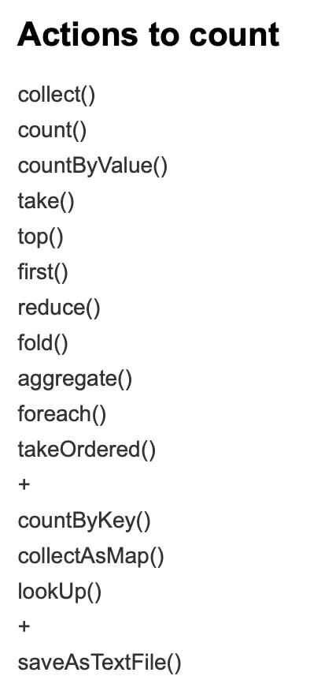

# Actions
 Are operations that 
    ▪ Return results to the Driver program
    ▪ i.e., return local (Java) variables
    ▪ Pay attention to the size of the returned results because they must be stored in the main memory of the Driver program 
    ▪ Or write the result in the storage (output file/folder)

