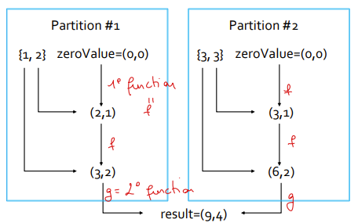

# Spark
- [Spark](#spark)
  - [Theoretical aspects](#theoretical-aspects)
    - [RDDs](#rdds)
    - [Shuffling](#shuffling)
  - [Configuration](#configuration)
  - [Methods](#methods)
    - [input](#input)
    - [transformations](#transformations)
    - [actions](#actions)
  - [Pair RDDs](#pair-rdds)
    - [traditional transformations](#traditional-transformations)
    - [specific transformations](#specific-transformations)
      - [by key](#by-key)
      - [others](#others)
      - [on key](#on-key)
    - [between two PairRDDs](#between-two-pairrdds)
    - [actions](#actions-1)
      - [methods](#methods-1)
  - [Persistence and cache](#persistence-and-cache)
    - [Storage levels](#storage-levels)
  - [Accumulators](#accumulators)
    - [Customized](#customized)
  - [Broadcast variables](#broadcast-variables)
- [Spark SQL](#spark-sql)
  - [Dataframe](#dataframe)
    - [Creation](#creation)
    - [Conversion to RDD](#conversion-to-rdd)
  - [Dataset](#dataset)
    - [Creation](#creation-1)
      - [\_from a file](#_from-a-file)
      - [\_from a local variable](#_from-a-local-variable)
      - [\_from a dataframe](#_from-a-dataframe)
      - [\_from an RDD](#_from-an-rdd)
    - [Operations](#operations)
    - [Aggregation functions](#aggregation-functions)
      - [groupBy](#groupby)
      - [sort](#sort)
  - [SQL based queries](#sql-based-queries)
    - [user defined functions](#user-defined-functions)
  - [Comparison](#comparison)

## Theoretical aspects
Spark components:
- Spark SQL 
- Spark streaming real-time: it is used to process live streams of data in real-time (example: the moving average)
- Spark MLlib
- Spark CORE: contains the basic functionalities of Spark exploited by all components:
  * task scheduling and synchronization
  * memory management
  * fault recovery: RDDs are automatically rebuilt in case of machine failures
  * ...

### RDDs
(Resilient Distributed Datasets)  
Are stored in the main memory of the executors running in the nodes of the cluster or in the local disk if there is not enough main memory.  
Allowing executing in parallel the code invoked on them.

> Each executor of a worker node runs the specified code on its partition of the RDD. Data is kept balanced so that there isn't a node with less items.

> RDDs are immutable once constructed

Spark tracks lineage information to efficiently recompute lost data.

>> If the input file is an HDFS file the number of partitions of the created RDD is equal to the number of HDFS blocks used to store the file, in order to support **data locality**.

### Shuffling
Data must be grouped/repartitioned based on a grouping criteria that is different with respect to the one used in the previous stage.

> It is a HEAVY operation.

## Configuration
```java
JavaSparkContext sc = new JavaSparkContext(conf);
```
## Methods
Each computation needs a new RDD. But since they are not executed until an action is triggered, there is a mechanism SPARK adopts to avoid the overusage of memory. Indeed, all the not anymore useful RDDs are eliminated to avoid the consumption of resources.
### input
>NOTHING HAPPENS WHEN EXECUTING THIS COMMAND

***Actions are executed only when needed (lazy programming)***
```java
// Build an RDD of Strings from the input textual file
// Each element of the RDD is a line of the input file
JavaRDD<String> lines=sc.textFile(inputFile);
lines.saveAsTextFile(outputPath); // --> to save the file in the specified path
```

```java
List<String> inputList = Arrays.asList("First element", "Second element", "Third element"); // --> on the pc
JavaRDD<String> distList = sc.parallelize(inputList); // --> on the cluster (doesn't execute any action --> lazy programming)
```

### transformations
- `JavaRDD<T> filter (Function<T, Boolean>)`: function that returns a boolean value must be passed as a parameter.
- `JavaRDD<R> map (Function<T, R>)`: the new RDD contains exactly one element y for each element x of the input RDD. The returned value (for each element can have a different type).
- `JavaRDD<R> flatMap(FlatMapFunction<T, R>)`:
  - for each input element, a list of elements is produced by applying a function --> the final result is a list of elements (i.e. not a list of list elements)
  - beware that duplicates are not removed
  ```java
  JavaRDD<String> listOfWordsRDD =  
    inputRDD.flatMap(x -> Arrays.asList(x.split(" ")).iterator()); 
  ```
- `JavaRDD<T> distinct()`: is a heavy operation, be sure to use it only if necessary, it removes the duplicates. A **shuffle** operation is needed.
- `JavaRDD<T> sample(boolean withReplacement, double fraction)`: first parameter is a boolean value that indicates whether the sample is with replacement or not, and the percentage.
- `JavaRDD<T> union(JavaRDD<T>)`: duplicates elements are not removed.
- `JavaRDD<T> intersection(JavaRDD<T>)`: a **shuffle** operation is executed (output will not contain any duplicate element).
- `JavaRDD<T> subtract(JavaRDD<T>)`: a **shuffle** operation is executed.
- `JavaRDD<T> cartesian(JavaRDD<T>)`: very expensive, computes the cartesian product.

### actions
- `List<Integer> retrievedValues = inputRDD.collect();`: returns a local Java list of objects containing the same objects of the considered RDD.
  - Pay attention to the size of the RDD
  - Large RDD cannot be memorized in a local variable, instead they can be saved in another file with the `inputRDD.saveAsTextFile()`.
- `long numLinesDoc1 = inputRDD.count();`: counts the number of lines/elements of the RDD.
- `Map<String, java.lang.Long> namesOccurrences = namesRDD.countByValue();`: counts how many times a value occurs.
- `List<Integer> retrievedValues = inputRDD.take(n);`: returns a local Java list of objects containing the first *n* elements of the considered RDD.
- `Integer firstValue = inputRDD.first();`: returns just the first element (not a List);
- `List<Integer> retrievedValues = inputRDD.top(n);`: returns a local Java list of objects containing the top *n* **largest** elements of the considered RDD (the ordering is the default one of class `T` (Integer))
    - variant: `top(n, comparator<T>)` for personalized rankings.
- `List<T> takeOrdered (int n, java.util.Comparator<T> comp)`: returns a local Java list of objects containing the top *n* **smallest** elements of the considered RDD. The order is specified by the developer.
- `List<T> takeSample(boolean withReplacement, int n, long seed)`:  returns a local Java list of objects containing n random elements.
- `Integer sum = inputRDDReduce.reduce((element1, element2) -> element1+element2)`: the function/lambda must be **associative** (computation can be performed in parallel) and **commutative**:
  1. Apply the user specified function/lambda on a pair of elements e1 and e2 occurring in L and obtain a new element *e_new*
  2. Remove the "original" elements *e1* and *e2* from L and then insert the element *e_new* in L;
  3. If L contains only one value then return it as final result of the reduce action. Otherwise, return to step 1.  
  Example:
  ```java
  SumCount zeroValue = new SumCount(0, 0); //SumCount is user-defined
  // it contains: numElements and the sum of them
  SumCount result = inputRDDAggr.aggregate(zeroValue, 
    (a, e) -> { // accumulator & list element --> partial result
    a.sum = a.sum + e;
    a.numElements = a.numElements + 1;
    return a;
    }, 
    (a1, a2) -> { // to the partial results
    a1.sum = a1. sum + a2.sum;
    a1.numElements = a1.numElements + a2.numElements;
    return a1;
  });
  ```

  
- `T fold(T zeroValue, Function2<T, T, T> f)`: can be used to parallelize functions that are *associative* but *non-commutative*.
- `U aggregate(U zeroValue, Function2<U,T,U> seqOp, Function2<U,U,U> combOp)`: similar to the reduce function, but it is used when it is necessary to return a different type:
  1. Aggregate the partial results in each partition, obtaining a set of partial results (of type U) **P = {p1, .., pn}**;
  2. Apply the second user specified function/lambda on a pair of 
  elements p1 and p2 in P and obtain a new element *p_new*;
  1. Remove the "original" elements *p1* and *p2* from P and then 
  insert the element *p_new* in P;
  1. If P contains only one value then return it as final result of the aggregate action. Otherwise, return to step 2.

## Pair RDDs
They contains values in the form KEY - VALUE.  
>> Any new modification implies a new PairRDD

To have this, we need a tuple format (not native in Java): `scala.Tuple2<K, V>`
- first element: `._1()` (key)
- second element: `._2()` (value)

A new instance can be created with: `new Tuple2<String, Integer>(word, 1)`
### traditional transformations
See above (`filter(), map(), ...`)
### specific transformations
#### by key
- `mapToPair()`: creates a new PairRDD by applying a function on each element of the inputRDD (i.e. not a pair);
  ```java
  JavaPairRDD<String, Integer> nameOneRDD=namesRDD.mapToPair(name -> new Tuple2<String,Integer>(name, 1));
  ```
- `flatMapToPair()`: creates a new PairRDD by applying a function f on each element of the "input" RDD
  - mind the type of the list `List<Tuple2<String, Integer>> pairs = new ArrayList<>();`
  - to return the result, it is necessary to return `return pairs.iterator();`
- `parallelizePairs()`: creates a new PairRDD from a local Java in-memory collection
  ```java
  ArrayList<Tuple2<String, Integer>> nameAge = new ArrayList<Tuple2<String, Integer>>();
  nameAge.add(new Tuple2<String, Integer>("Paolo", 40));
  JavaPairRDD<String, Integer> nameAgeRDD = sc.parallelizePairs(nameAge);
  ```
- `reduceByKey()`: doesn't change the type of data -- returns key-value pairs
  - beware that a **shuffle** operation is executed
  - 
  ```java
  JavaPairRDD<String, Integer> youngestPairRDD =
  nameAgeRDD.reduceByKey(
    (age1, age2) -> {
      if (age1<age2) // the two vaues belong to the same KEY
        return age1;
      else
        return age2;
    }
  );
  ```
- `foldByKey()`: must be associative but it is not required to be commutative. The goal is the same as `reduceByKey()` but in this case it is also possible to specify a starting value (e.g. for the count).
  - a **shuffle** operation is executed
- `combineByKey()`: change the type of values (doesn't change the key type)
  - three functions are needed (input value type can be `U`, second function transforms it into `V` and the key type remains the same)
  - it is more general, because can change the type (no reason to use it if data type is not changed)
  - requires a **shuffle** operation
  - 
  ```java
  JavaPairRDD<String, AvgCount> avgAgePerNamePairRDD=nameAgeRDD.combineByKey    
      (inputElement-> new AvgCount(inputElement, 1), // given an Integer, it returns an AvgCount object

      (intermediateElement, inputElement) -> {
        AvgCount combine=new AvgCount(inputElement, 1);
        combine.total=combine.total+intermediateElement.total;
        combine.numValues = combine.numValues + intermediateElement.numValues;
        return combine; 
      }, 
      // merge the intermediate elements   >>   37.5 ,  2       //          40  ,  3        -->       77.5  ,   5
      (intermediateElement1, intermediateElement2) -> {
        AvgCount combine = new AvgCount(intermediateElement1.total, 
        intermediateElement1.numValues);
        combine.total=combine.total+intermediateElement2.total;
        combine.numValues=combine.numValues + intermediateElement2.numValues;
        return combine; 
      }
  );
  ```
- `groupByKey()`: 
  - TO NOT BE USED TO COMPUTE AGGREGATATION because it is highly inefficient (sum, average); prefer reduceByKey, aggregateByKey
    - from big data --> new big data (bad)
    - use this function ONLY if there is no other option (aggregation/computation of a function that is **not associative**).
  - a **shuffle** operation is required
  - it works just by calling the function inline: `JavaPairRDD<String, Iterable<Integer>> agesPerNamePairRDD = nameAgeRDD.groupByKey();`: iterable is the list of ages.

#### others
- `JavaPairRDD<K,U> mapValues(Function<V, U> f)`: key is the same, the input and output type change
- `JavaPairRDD<K,U> flatMapValues(Function<V, Iterable<U>> f)`: for one key, multiple values are generated

#### on key
- `JavaPairRDD<String, Integer> sortedNameAgeRDD=nameAgeRDD.sortByKey()`
  - if key is the same, the values are NOT analyzed

### between two PairRDDs
- `JavaPairRDD<K,V> subtractByKey(JavaPairRDD<K,U> other)`: if a key is present in the other JavaPairRDD, then it is removed from the original one
  - it works only on the keys
  - a **shuffle** operation is needed
  - example: `JavaPairRDD<String, Integer> selectedUsersPairRDD = profilesPairRDD.subtractByKey(bannedPairRDD);`
- `JavaPairRDD<Integer, Tuple2<String, String>> joinPairRDD = questionsPairRDD.join(answersPairRDD);` 
  - a **shuffle** operation is needed
  ```txt
  Example:
  A  1   A  10         A   1  10
  B  2   B  20   >>>   B   2  20
  C  3   B  30         B   2  30
  ```
- `JavaPairRDD<Integer, Tuple2<Iterable<String>, Iterable<String>>> cogroupPairRDD = moviesPairRDD.cogroup(directorsPairRDD);`
  - requires a **shuffle** operation

### actions
Again, an action generate a LOCAL JAVA VARIABLE:
- beware of the size
- beware of the keys (they can be duplicated in the RDDs)

#### methods
- `Map<K, Object> countBykey()`: returns an Object even if it is a `Long`
  - beware of the size, since the returning variable is locally stored
- `Map<String, String> retrievedPairs = usersRDD.collectAsMap();`
  - ***beware that each key will appear only once!***: do it only if there is the certainty that there are no multiple keys
  - beware of the size, since the returning variable is locally stored
- `List<Integer> movieRatings = movieRatingRDD.lookup("Forrest Gump");`
  - beware of the size, since the returning variable is locally stored

## Persistence and cache
If the same RDD is used multiple times in an application, Spark recomputes its content every time an action is invoked on the RDD, or on one of its descendants. This is expensive, especially for iterative applications.
> We can ask Spark to persist/cache RDDs so that each node stores the content of its partitions in memory and reuses them in other actions on that RDD.

### Storage levels
>> ***The use of the persist/cache mechanism on an RDD provides an advantage if the same RDD is used multiple times.***
>> i.e., multiples actions are applied on it or on its descendants

 It can be defined using the `persist()` function (ex: `inRDD.persist(StorageLevel.MEMORY_ONLY())`) or the `cache()` one, which is exaclty the example. Both *return a new RDD*. The possible `StorageLevel` are:
- `MEMORY_ONLY`: Store RDD as deserialized Java objects in the JVM. If the RDD does not fit in memory, some partitions will not be cached and will be *recomputed* on the fly each time. This is the **default** level.
- `MEMORY_AND_DISK`: Store RDD as deserialized Java objects in the JVM. If the RDD does not fit in memory, *store* the partitions that don't fit on (local) *disk*, and read them from there.
- `MEMORY_ONLY_SER`: Store RDD as serialized Java objects. This is generally more space-efficient than deserialized objects, especially when using a fast serializer, but more CPU-intensive to read. 
- `MEMORY_AND_DISK_SER`: Similar, but spills partitions that don't fit in memory to disk instead of recomputing them on the fly.
- `DISK_ONLY`: Store the RDD partitions only on disk. It is useful only if the size of the RDD is much smaller than the input dataset or the functions to compute the content of the RDD are expensive. (otherwise recomputing ≅ I/O disk).
- `MEMORY_ONLY_2`, `MEMORY_AND_DISK_2`, ...: Same as the aboves, but replicate each partition on 2 cluster nodes. This allows redundancy (save in different disks).

## Accumulators
When a "function" passed to a Spark operation is executed on a remote cluster node, it works on separate copies of all the variables used in the function. No updates are propagated back to the SparkDriver class.

Accumulators are shared variables that are only *added to* through an associative operation and can therefore be efficiently supported in parallel.
>> They can be used to implement **counters** (as in MapReduce) or **sums**.

The advantage is to avoid using `.reduce()` function to compute simple statistics.

How they work:
- the SparkDriver defines and initializes the accumulators (`Long` and `Double` are the native ones).
- the nodes increase the value of the accumulators (they cannot read the value, just increase it).
- the final values of the accumulators are acessible just from the **SparkDriver class**.

>> ATTENTION:
>> The values of the accumulators are updated only when there is an action that trigger the execution of the transformations.

Since the accumulator value can be increased multiple times in some portion of the code resulting in a wrong value, accumulators are typicall updated inside `foreach()` functions which don't have returning values.

**Example**
```java
import org.apache.spark.util.AccumulatorV2;

SparkContext ssc = sc.sc();
final LongAccumulator acc = ssc.longAccumulator();
acc.add(1); // in some action/transformation
// action that triggers the transformations
validEmailsRDD.saveAsTextFile(outputPath);
acc.value(); // to retrieve the final value after the actions/transformations
```

### Customized
To define a new accumulator data type, the abstract class `org.apache.spark.util.AccumulatorV2<T,T>` must be extended.
```java
MyAcculumator myAcc = new MyAccumulator();
sc.sc().register(myAcc, "MyNewAcc"); // to add it to the spark context
```

## Broadcast variables
A broadcast variable is READ-ONLY (medium/large size) shared variable. It is instantiated in the SparkDriver class and sent to all worker nodes that use  it in one or more actions. ***A COPY of it is sent ONE TIME to the nodes***. 

The amount of data sent over the network is limited with this solution wrt to use standard variables.

>> Broadcast variables are usually used to share (large) lookup-tables.
>> *Pay attention that a broadcast variable can be instantiated only by passing as parameter a local java variable and not an RDD.*

```java
for (Tuple2<String, Integer> pair: dictionaryRDD.collect()) {
  dictionary.put(pair._1(), pair._2());
}
final Broadcast<HashMap<String, Integer>> dictionaryBroadcast = sc.broadcast(dictionary);

// ...

JavaRDD<String> mappedTextRDD =textRDD.map(
  line -> {
    String transformedLine=new String("");
    Integer intValue;
    // map each word to the corresponding integer
    String[] words=line.split(" ");
    for (int i=0; i<words.length; i++) {
      intValue=dictionaryBroadcast.value().get(words[i]);
      transformedLine=transformedLine.concat(intValue+" ");
    }
    return transformedLine;
});
```

<hr>

# Spark SQL
Spark SQL uses this extra information to perform extra optimizations based on an SQL-like optimizer called Catalyst.  
>> Programs based on Datasets are usually faster than standard RDD-based programs

Definitions:
- `Dataset`: is a distributed collection of structured data (RDD benefits such as strong typing and lambda functions) + optimization execution engine
- `DataFrame`: is a Dataset of Row objects

To save on disk the result of the computation:
- convert into RDD and the use `rdd.saveAsTextFile(String outputFolder)`
- use the `DataFrameWriter<Row> write()` + `format(String filetype)` + `save(ouputFolder)`
  ```java
  ds.JavaRDD().saveAsTextFile(outputPath);
  // or
  ds.write().format("csv").option("header", true).save(outputPath);
  ```

## Dataframe
### Creation
```java
SparkSession ss = SparkSession.builder().appName("Test SparkSQL").getOrCreate();

// From a CSV file
DataFrameReader dfr = ss.read().format("csv")
    .option("header", true)         // first line contains the column names
    .option("inferSchema", true);   // data types must be inferred by the system
Dataset<Row> df = dfr.load("persons.csv");

// From JSON
DataFrameReader dfr=ss.read().format("json");
Dataset<Row> df = dfr.load("persons.json");

// From JSON files
DataFrameReader dfr=ss.read()
    .format("json")
    .option("multiline", true);     // if an object is spread across multiple lines
Dataset<Row> df = dfr.load("folder_JSONFiles/"); // <<< FOLDER (read several files)

// many other formats available (parquet, db, hive tables, ...)
```

### Conversion to RDD
By calling the `datasetRow.javaRDD()` method, the returned object is a `JavaRDD<Row>` object having for each `Row` a vector containing: `[("name","antonio"),("age","12"), ... all other values ]`.

Example (executional cost is similar):
```java
JavaRDD<Row> rddPersons = df.javaRDD();
JavaRDD<String> rddNames = rddPersons.map(
  inRow-> (String)inRow.getAs("name")      // explicit casting
);
// or
JavaRDD<String> rddNames = rddPersons.map(
  inRow-> inRow.getString(inRow.fieldIndex("name"))
); 
```

## Dataset
They are more general with respect to the Dataframes. They are still more efficients than RDDs.

### Creation
Each line of a dataset can be encoded into a specific object. The class object must implement the `Serializable` interface.
>> this class object MUST have all the getters and setters for all the fields.

#### _from a file
```java
DataFrameReader dfr = ss.read()
    .format("csv")
    .option("timestampFormat", "yyyy-MM-dd HH:mm:ss")
    .option("delimiter", "\\t")
    .option("header", true)
    .option("inferSchema", true)
;

Encoder<Register> registerEncoder = Encoders.bean(Register.class);
Dataset<Register> dsRegister = dfr.load(inputPath).as(registerEncoder);
Dataset<Register> filteredRegisters = dsRegister.filter(
    input -> {
      if (input.getFree_slots() == 0 && input.getUsed_slots() == 0) {
        return false;
      } else {
        return true;
      }
    });

// THE CLASS OBJECT
import java.io.Serializable;
public class Register implements Serializable {
    private int station;         // same name as the column in the file
    private String timestamp;    // same name as the column in the file
    private int used_slots;      // same name as the column in the file
    private int free_slots;      // same name as the column in the file

    // all getters and setters
}
```

#### _from a local variable
It is also possible to create a Dataset starting from a local variable:
```java
ArrayList<Person> persons = new ArrayList<>();
// populate the list ...
Encoder<Person> personEncoder = Encoders.bean(Person.class);
Dataset<Person> personDS= ss.createDataset(persons, personEncoder);
```

If the objects are simply integers or others, `Encoders.INT()`, `Encoders.STRING()`, ... can be used.

#### _from a dataframe
By using the `.as(Encoder encoder)` method of the dataframe class.

#### _from an RDD
It is necessary to:
 1. convert the java RDD into a scala RDD: `JavaRDD.toRDD(inJavaRDD)`
 2. create the dataset from the scala RDD: `Dataset<T> createDataset(RDD<T> inRDD, Encoder<T> encoder)`

### Operations
- `ds.show()`
- `ds.count()`: returns the number (`long`) of rows in the input dataset
- `ds.distinct()`: returns a new Dataset that contains the unique rows of the input Dataset. 
  - it is an **heavy** operation in terms of data sent over the network
  - it requires a **shuffle** phase
- ` ds.select("name","age")`: returns a new dataset having selected just the specified columns
  - it is a *dangerous* operation because errors are generated at *runtime* if the column name is mispelled
- `ds.selectExpr("name", "age", "age+1 as newAge");`: returns a new Dataset that contains a set of columns computed by combining the original columns
  - this method can generate errors at *runtime* if there are typos in the expressions
- `.map(...)` (which is a type-safe version of the *select*)
  ```java
  Dataset<PersonNewAge> ds2 = ds.map(
    p -> {
      PersonNewAge newPersonNA=new PersonNewAge();
      newPersonNA.setName(p.getName());
      newPersonNA.setAge(p.getAge());
      newPersonNA.setGender(p.getGender());
      newPersonNA.setNewAge(p.getAge()+1);
      return newPersonNA; 
    }, Encoders.bean(PersonNewAge.class)
  );
  ```
  - the advantage is that errors at runtime are prevented (but it has a cost in terms of writing code because a new encoder must be created for each transformation).
- `ds.filter("age>=20 and age<=31")`: returns a new Dataset (typed or not) with the filtered data.
  - A version type-safe also exists for avoiding typos --> lambda function.
  - `.where(String expression)` is an alias for the filter function.
- `Dataset<Row> join(Dataset<T> right, Column joinExprs)`:
  - it returns a new Dataframe (`Dataset<Row>`)
  - can generate errors at runtime if there are errors in the joinExpr
  - example: `= dsPersons.join(dsUidSports, dsPersons.col("uid").equalTo(dsUidSports.col("uid")));`
  - also the type of the join can be expressed:
    - inner, outer, full, fullouter (*non-matched records are set to null but not removed*), leftouter, left, rightouter, right, leftsemi, leftanti (*used for the subtract, only non-matched rows are kept*), cross (*cartesian product*)
    - `Dataset<Row> nonBannedProfiles= dsProfiles.join(dsBanned,dsProfiles.col("uid").equalTo(dsBanned.col("uid")),"leftanti")`

### Aggregation functions
>> Already available: `avg(column), count(column), sum(column), abs(column)`.

Pay attention that the aggreation can cause errors at *runtime* due to typos.
```java
Dataset<Row> averageAge = ds.agg(avg("age"), count("*"));  // the new dataset contains two columns: 'avg(age)' and 'count(*)'
```

#### groupBy
`RelationalGroupedDataset groupBy(String col1, .., String coln)`.  
The class `RelationalGroupedDataset` can be used to split the input data in groups and compute aggregate function over each group.

>> Attention: **this can cause errors at *runtime***

Example:
```java
RelationalGroupedDatasetrgd=ds.groupBy("name");
Dataset<Row> nameAverageAge = rgd.avg("age", count("name"));
```

#### sort
` Dataset<T> sort(String col1, .., String coln) `.  
Returns a new dataset that contains the same data as the input one, but **sorted**.

>> Attention: **this can cause errors at *runtime***

```java
Dataset<Person> sortedAgeName = ds.sort(new Column("age").desc(), new Column("name"));
```

## SQL based queries
`void createOrReplaceTempView (String tableName)` method of the `Dataset<Row>` class can be used to assign a table which name is tableName that can be used in the further queries (in the FROM clause).

```java
SparkSessionss = SparkSession.builder().appName("Test SparkSQL").getOrCreate();
ds.createOrReplaceTempView("people");      // creates the table 'people'
Dataset<Row> selectedPersons = ss.sql("SELECT * FROM people WHERE age>=20 and age<=31");
```

### user defined functions
The programmer can also define a set of system functions
```java
ss.udf().register("dow",
  (Timestamp timestamp) -> {
    return DateTool.DayOfTheWeek(timestamp);
  }, DataTypes.StringType
);

// in the SQL query, the function 'dow(...)' can be called
```
> Attention:
> - if `inferSchema` option has been set to true, the type of the input parameter has to be the one in the input file.
> - the returning type must be specified

In any case there are the SQL predefined functions, which are: `hour(Timestamp), abs(Integer), ...`

There is also the possibility to defined user defined aggregate functions which are based on the implementation of the `org.apache.spark.sql.expressions.UserDefinedAggregateFunction` abstract class.

## Comparison
(runtime is bad because you cannot check before the execution)
||**SQL**|**DataFrames**|**Datasets**|
|:---|:---:|:---:|:---:|
|*Syntax Errors*| **Runtime** | Compile time | Compile time
|*Analysis Errors*| **Runtime** | **Runtime** | Compile time|
